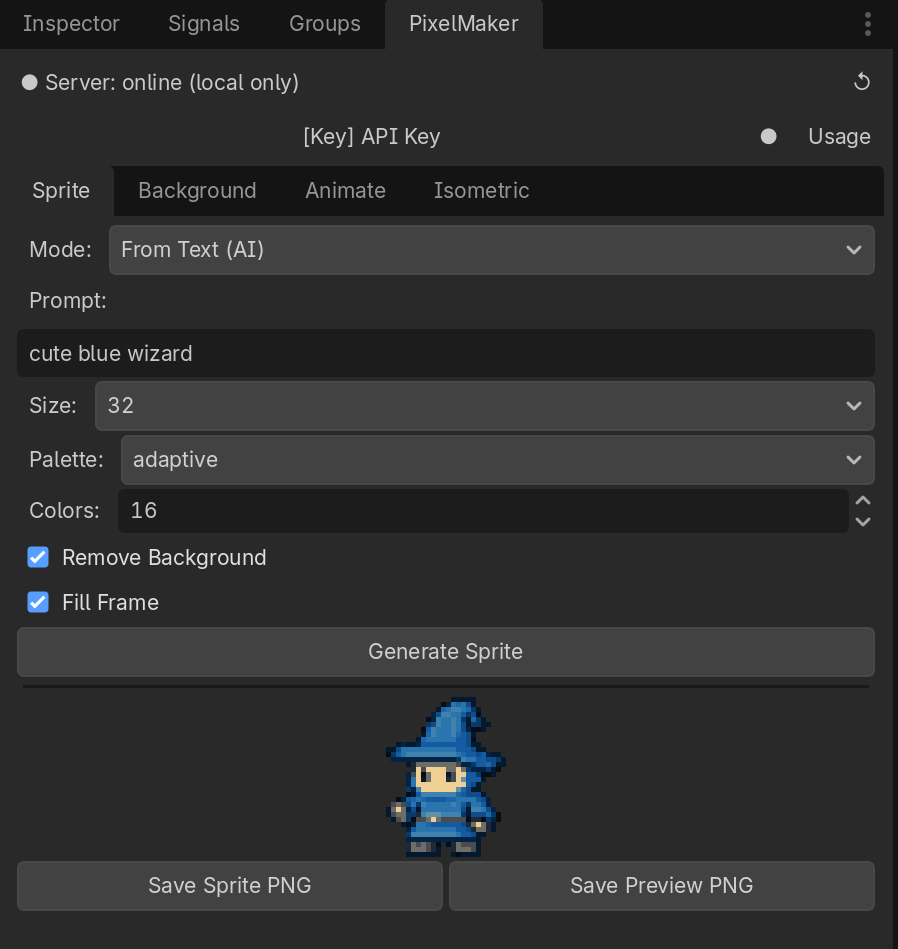

# PixelMaker — Godot 4 Editor Plugin

Generate pixel art sprites, backgrounds, walk-cycle animations, and isometric
tilesets directly inside the Godot editor. AI generation via OpenAI (API key
required); image conversion and animation work fully offline. Includes a
bundled Python server that starts automatically — no manual setup needed.

The standalone web version lives at
**[github.com/kbraiden/pixelmaker](https://github.com/kbraiden/pixelmaker)**.

---

## Screenshots



---

## Features

| Feature | Needs API key? |
|---|---|
| Sprite from text prompt (AI) | Yes |
| Image → pixel art conversion | No |
| Background from text prompt (AI) | Yes |
| Walk / idle / jump / attack animation | No |
| Isometric tileset from text prompt (AI) | Yes |

- **Four-tab editor dock** — Sprite, Background, Animate, Isometric
- **Bundled Python server** — starts automatically; pip dependencies install on first run
- **Saves into your project** — save dialog opens inside `res://` so assets appear in the FileSystem panel immediately
- **API key management** — key stored in editor settings (never in project files), hidden by default; **Usage** button shows this month's OpenAI spend and remaining balance

---

## Requirements

| | Version |
|---|---|
| Godot | 4.2 or later |
| Python | 3.10 or later, in `PATH` |
| OpenAI API key | Only for AI generation features |

---

## Installation

### Godot Asset Library
Search for **PixelMaker** in the Godot editor's **Asset Store** tab.

### Manual
1. Download `pixelmaker-godot-plugin.zip` from [Releases](../../releases).
2. Extract and copy `addons/pixelmaker/` into your project:
   ```
   your-project/
   └── addons/
       └── pixelmaker/
   ```
3. **Project → Project Settings → Plugins** → enable **PixelMaker**.

### Clone
```bash
git clone https://github.com/kbraiden/pixelmaker-godot-plugin.git
```
Copy `addons/pixelmaker/` into your project's `addons/` folder, then enable the plugin.

---

## First-time setup

1. Enable the plugin — the Python server starts automatically in the background.
2. Wait a few seconds for **● Server: online** to appear in the dock header.
   On first run, pip installs dependencies (30–60 s).
3. Click **[Key] API Key**, paste your OpenAI key, press Enter.
   The key is saved to editor settings and the field hides again.
4. Pick a tab and generate.

> **No OpenAI key?** The **Sprite → From Image** and **Animate** tabs work
> entirely locally — no key needed.

---

## Tabs

### Sprite
- **From Text (AI)** — prompt → pixel sprite at 16 / 32 / 64 / 128 px with palette options.
- **From Image (local)** — drop any PNG / JPEG / WebP; pixelated locally.

### Background
Prompt → wide pixel-art scene (up to 3840 × 2160), optional seamless tiling.

### Animate
Upload a pixel sprite, choose walk / idle / jump / attack and frame count.
Returns a **sprite sheet PNG** and an **animated GIF**.

### Isometric
Enter a surface material (e.g. "grass") and optional side material.
Choose tile width and height variants (full / half / quarter / slab).
Returns tile PNGs ready for a Godot 4 **TileSet**.

---

## Server details

The plugin ships a [FastAPI](https://fastapi.tiangolo.com/) server
(`addons/pixelmaker/server/`) running on `127.0.0.1:8765` — separate from the
standalone app (port 8000) so both can coexist.

Manual controls: **Tools → PixelMaker → Start / Stop Server / Open Web UI**

---

## Troubleshooting

| Symptom | Fix |
|---|---|
| `Server: offline` on startup | Wait 30–60 s on first run. Then **Tools → PixelMaker: Start Server**. |
| Python not found | Install Python 3.10+ and ensure `python` or `python3` is in `PATH`. |
| AI generation fails | Check your API key is set and has credit. Click **Usage** to verify. |
| Dock is blank | Disable and re-enable the plugin in **Project → Project Settings → Plugins**. |

---

## License

MIT — see [LICENSE](LICENSE).

Pixel art algorithms adapted from
[kbraiden/pixelmaker](https://github.com/kbraiden/pixelmaker), also MIT.

---

## Features

| Tab | What it does | Needs OpenAI key? |
|---|---|---|
| **Sprite** | Generate a pixel sprite from a text prompt, or pixelate an uploaded image | Text mode: yes / Upload mode: no |
| **Background** | Generate a pixel-art background (tileable or full-width) from a prompt | Yes |
| **Animate** | Upload a sprite → get walk / idle / jump / attack animation frames, sprite sheet, and GIF | No (fully local) |
| **Isometric** | Generate a 2:1 iso tileset (full/half/quarter/slab variants) with a ready-to-import Godot 4 `TileSet` resource | Yes |

---

## Requirements

- **Godot 4.2+**
- **Python 3.10+** in your system `PATH`
  ([download](https://www.python.org/downloads/))
- Python packages are auto-installed on first run (internet needed once):
  `fastapi`, `uvicorn`, `pillow`, `numpy`, `python-dotenv`, `python-multipart`, `openai`
- An **OpenAI API key** for AI-powered features (Sprite from text, Background, Isometric).
  Local features (Sprite from image, Animate) work without a key.

---

## Installation

### Option A — Copy into an existing project

1. Copy the entire `addons/pixelmaker/` folder into your Godot project's
   `addons/` directory.
2. Open **Project → Project Settings → Plugins** and enable **PixelMaker**.

### Option B — Use this repository as a standalone plugin

1. Clone or download this repository.
2. In Godot, open **Project → Project Settings → Plugins**, click **Install**,
   and point it at the `addons/pixelmaker/plugin.cfg` file.

---

## First-time setup

When the plugin is enabled for the first time:

1. Godot launches the Python server in the background (`127.0.0.1:8765`).
2. Python auto-installs any missing pip packages from `requirements.txt`.
   This may take 30–60 seconds on the first run.
3. The dock status indicator changes from **offline** → **online (local only)**
   (or **online + AI** if an API key is configured).

If the status shows **offline**, use the editor menu:
**Tools → PixelMaker: Start Server**

---

## Usage

### Sprite tab

- **From Text (AI)** — enter a prompt (e.g. `a blue wizard`) and click
  **Generate Sprite**.  Requires an OpenAI API key in the *API Key* field.
- **From Image (local)** — click **Choose Image** to upload any photo or
  drawing; the engine downscales and quantizes it locally.

Adjust **Size** (16 / 32 / 64 / 128 px grid), **Palette**, and **Colors**,
then use **Save Sprite PNG** / **Save Preview PNG** to write the files.
The file dialog opens at your project root by default.

### Background tab

Enter a scene description, set dimensions and pixel size, then generate.
Enable **Tileable** to make the result repeat seamlessly.

### Animate tab

1. Click **Choose Sprite** to upload a true-size pixel sprite (PNG).
2. Pick an action: `walk`, `idle`, `jump`, or `attack`.
3. Click **Generate Animation**.
4. Save the **Sprite Sheet** (for LibreSprite / Aseprite import) or the
   **GIF** preview.

### Isometric tab

1. Enter a **Top Texture Prompt** (e.g. `moss-covered stone`).
2. Optionally enter a **Side Texture Prompt** (blank = auto-shade from top).
3. Choose tile width, palette, and which height variants to generate.
4. Click **Generate Isometric Tiles**.
5. Click **Save ZIP** — the archive contains:
   - Individual tile PNGs
   - A packed atlas PNG (`<name>_atlas.png`)
   - A Godot 4 TileSet resource (`<name>_tileset.tres`)
   - Import notes

**To import the tileset:**
1. Unzip into your project root (e.g. `res://grass/`).
2. Add a `TileMapLayer` node and assign `grass/grass_tileset.tres` as its
   **Tile Set**.
3. Enable **Y-Sort** on the layer for correct depth ordering.

---

## Server management

The Python server runs on `http://127.0.0.1:8765`.  
The editor menu (**Tools** → **PixelMaker: …**) provides:

| Menu item | Effect |
|---|---|
| **Start Server** | Launch (or re-launch) the Python server |
| **Stop Server**  | Kill the server process |
| **Open Web UI**  | Open the full web interface in your browser |

The server is started automatically when the plugin loads and stopped when
it is disabled.

---

## Architecture

```
addons/pixelmaker/
├── plugin.cfg          Godot plugin metadata
├── plugin.gd           EditorPlugin — server lifecycle + menu items
├── dock.gd             Editor dock — full UI (4 tabs, built programmatically)
└── server/
    ├── launcher.py     Auto-installs deps, then starts uvicorn on port 8765
    ├── requirements.txt
    └── app/            FastAPI application (identical to standalone pixelmaker)
        ├── main.py     REST endpoints (/api/generate, /api/convert, …)
        ├── pixelate.py Core pixelation engine
        ├── walkcycle.py Walk-cycle generator
        ├── animations.py  Idle / jump / attack generators
        ├── isometric.py   2:1 iso tile builder + Godot TileSet exporter
        ├── palettes.py    NES / Game Boy / CGA / PICO-8 palettes
        ├── config.py      Settings (reads OPENAI_API_KEY from .env)
        └── providers/  AI image provider abstraction (OpenAI)
```

The dock communicates with the server over `HTTPRequest` (Godot's built-in
HTTP client).  Responses carry base-64-encoded PNG / ZIP data which the dock
decodes with `Marshalls.base64_to_raw()`.

---

## Troubleshooting

| Symptom | Fix |
|---|---|
| Status shows **offline** | Click ↺ to recheck; use Tools → PixelMaker: Start Server |
| First run is slow | Python is installing packages — wait ~60 s |
| `Python not found` error | Install Python 3.10+ and make sure it's in your system PATH |
| AI features return 503 | Enter a valid OpenAI API key in the API Key field |
| Animate produces a blank sheet | Ensure the uploaded sprite has transparent background (RGBA PNG) |

---

## License

This plugin bundles code from the [PixelMaker](https://github.com/kbraiden/pixelmaker)
project. See the root `LICENSE` file for details.
